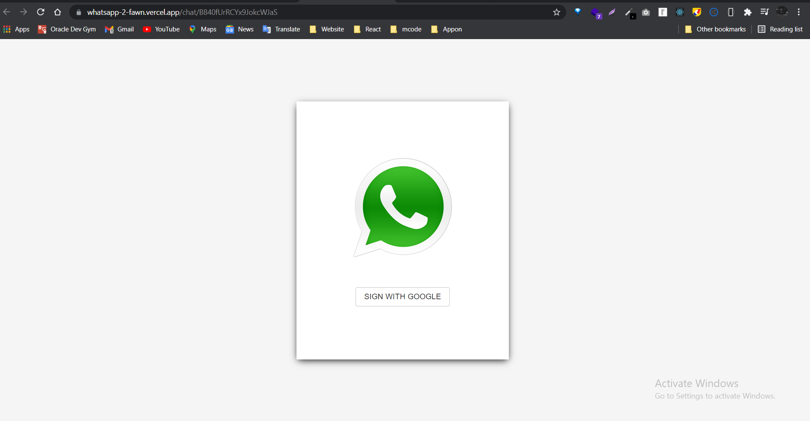
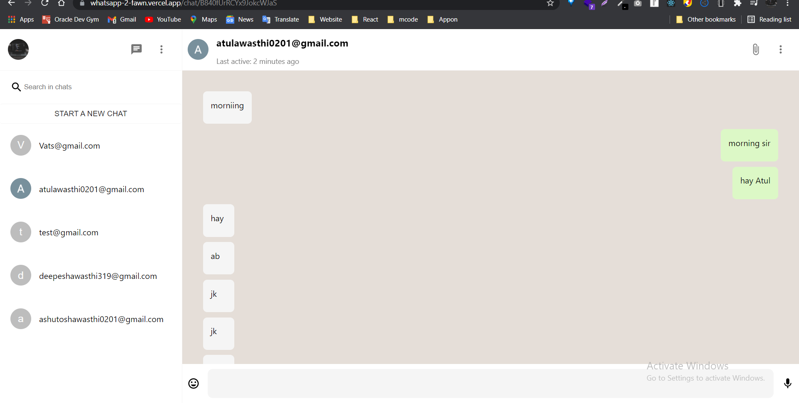
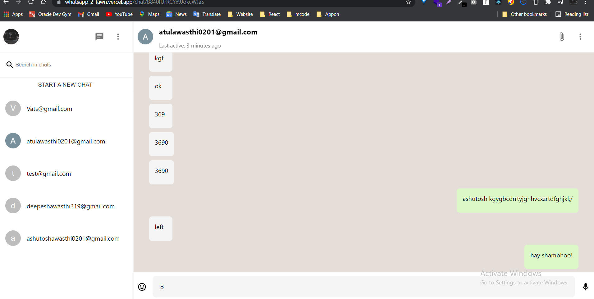
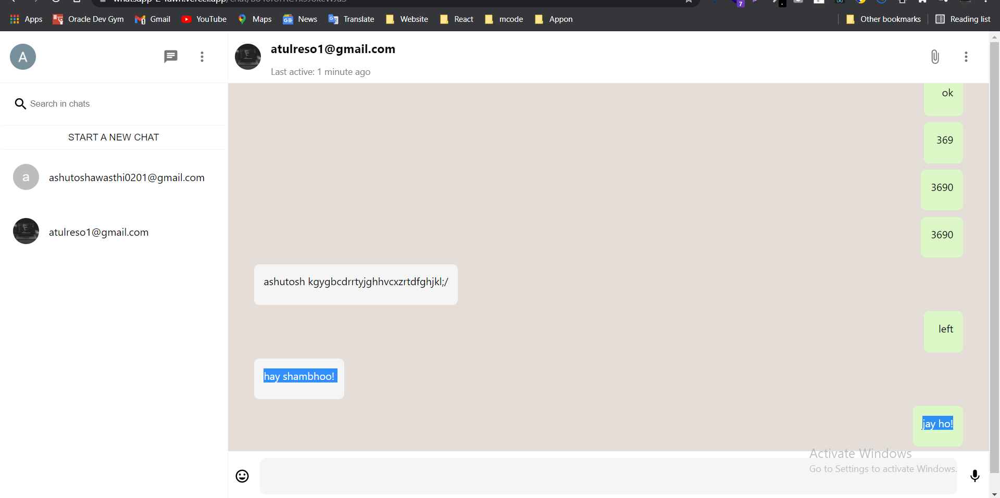
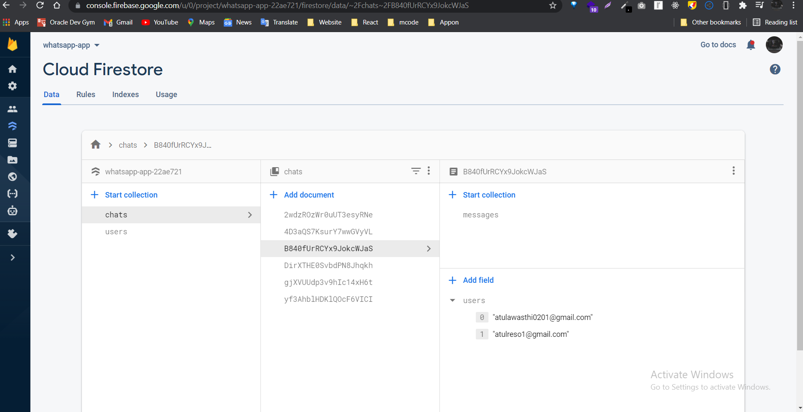

## Features:


web-app link:  https://whatsapp-2-fawn.vercel.app

 

* This is a two-way chatting web app, users can send and receive messages.

* To sign in to this web-app users have added two e-mail IDs in the google authentication section, for chat interaction between them.
* Users can authenticate using google login.
* Users can click on "start a new chat" and type a valid email id or an existing second email id.
* Click on the newly created email to start a chat. 
* Login users can write a message to a newly created email chat.
* If the user doesn't write anything on the message and hits the enter button then it will show an alert box.
* Users can write a message with text, emoji and send that by clicking on the entering button.
* Hit on the top left user profile icon to log out.
* To read and reply to that message/chat again login with the newly created email and click on the previous login email in the left side bar then see/write your chat, with last seen user active on chat.
* Users can see the last seen active users on top of the header.
* I'm using server-side rendering in this so can take a few seconds to load all chats.
 


This is a [Next.js](https://nextjs.org/) project bootstrapped with [`create-next-app`](https://github.com/vercel/next.js/tree/canary/packages/create-next-app). 

## Getting Started

First, run the development server:
 
```bash
npm run dev
<!-- @import "[TOC]" {cmd="toc" depthFrom=1 depthTo=6 orderedList=false} -->

# or
yarn dev
```

### Snapshots of project 👇












Open [http://localhost:3000](http://localhost:3000) with your browser to see the result.

You can start editing the page by modifying `pages/index.js`. The page auto-updates as you edit the file.

[API routes](https://nextjs.org/docs/api-routes/introduction) can be accessed on [http://localhost:3000/api/hello](http://localhost:3000/api/hello). This endpoint can be edited in `pages/api/hello.js`.

The `pages/api` directory is mapped to `/api/*`. Files in this directory are treated as [API routes](https://nextjs.org/docs/api-routes/introduction) instead of React pages.

## Learn More

To learn more about Next.js, take a look at the following resources:

- [Next.js Documentation](https://nextjs.org/docs) - learn about Next.js features and API.
- [Learn Next.js](https://nextjs.org/learn) - an interactive Next.js tutorial.

You can check out [the Next.js GitHub repository](https://github.com/vercel/next.js/) - your feedback and contributions are welcome!

## Deploy on Vercel

The easiest way to deploy your Next.js app is to use the [Vercel Platform](https://vercel.com/new?utm_medium=default-template&filter=next.js&utm_source=create-next-app&utm_campaign=create-next-app-readme) from the creators of Next.js.

Check out our [Next.js deployment documentation](https://nextjs.org/docs/deployment) for more details.
